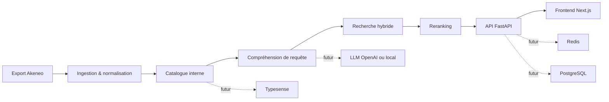

# Architecture cible MVP

## Vue d'ensemble

Le projet est structure pour evoluer vers l'architecture du cahier des charges tout en restant exploitable des maintenant en local.

## Modules backend

- `app/services/catalog_ingestion.py`
  Charge un export Akeneo JSON local ou un catalogue Akeneo distant, puis normalise les produits.
- `app/services/akeneo_client.py`
  Authentifie le backend sur Akeneo via OAuth2 et recupere produits, attributs et categories.
- `app/services/typesense_service.py`
  Gere la recreation de la collection, l'import des produits et la recherche de candidats via Typesense.
- `app/services/query_understanding.py`
  Interprete la requete utilisateur et extrait les filtres.
- `app/services/hybrid_search.py`
  Calcule un score lexical, un score semantique, puis applique un reranking.
- `app/services/search_engine.py`
  Orchestre bootstrap, reindexation, recherche et exposition a l'API.

## Contrats actuels

- Ingestion:
  export Akeneo simplifie en JSON
- Recherche:
  `POST /api/v1/search`
- Frontend:
  UI conversationnelle minimaliste et orientee debug produit

## Evolution recommandee

1. Remplacer l'export statique par un connecteur Akeneo avec credentials.
2. Pousser les documents normalises dans Typesense pour la recherche hybride a grande echelle.
3. Brancher un parseur LLM pour produire une requete structuree.
4. Mettre Redis devant les requetes frequentes et PostgreSQL pour les jobs et la telemetrie.
